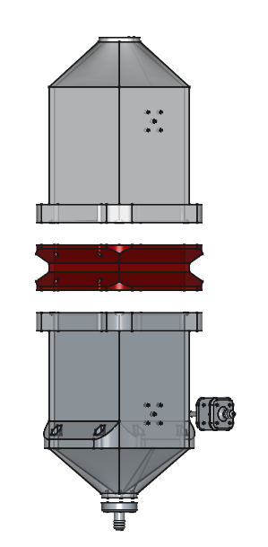

# Flowres - Hardware

This vault serves as a knowledge base for the hardware of the mostly printed flow resistivity measurement setup. The outline of the vault is given in [Navigation](00_Navigation.md).

$$\sqrt{\frac{dfs}{fds}dfs^2 \mu}$$

The 3D printed parts are modelled in [FreeCAD](https://www.freecadweb.org/), a free and open-source
parametric 3D CAD software. The models are stored in the `models` directory of the [`flowres-hardware`](https://www.github.com/vyhyb/flowres-hardware) repository on GitHub

The software part of the project can be found [here](https://www.github.com/vyhyb/flowres).

This vault is exported as a website and can be viewed [here](https://vyhyb.github.io/flowres-hardware/).

## Author

- [David Jun](https://www.fce.vutbr.cz/o-fakulte/lide/david-jun-12801/)
  
  PhD student at [Brno University of Technology](https://www.vutbr.cz/en/).

## Contributing

Pull requests are welcome. For any changes, please open an issue first
to discuss what you would like to change.

Please make sure to update tests as appropriate.

## License

[GNU GPLv3](https://choosealicense.com/licenses/gpl-3.0/)

Flowres-Hardware - Hardware for the mostly printed flow resistivity measurement setup

Copyright (C) 2025 David Jun

This program is free software: you can redistribute it and/or modify
it under the terms of the GNU General Public License as published by
the Free Software Foundation, either version 3 of the License, or
(at your option) any later version.

This program is distributed in the hope that it will be useful,
but WITHOUT ANY WARRANTY; without even the implied warranty of
MERCHANTABILITY or FITNESS FOR A PARTICULAR PURPOSE.  See the
GNU General Public License for more details.

You should have received a copy of the GNU General Public License
along with this program.  If not, see <https://www.gnu.org/licenses/>.

## References

[1] ČSN EN ISO 9053-1 - Akustika - Stanovení odporu proti proudění vzduchu - část 1: Metoda statického proudění vzduchu, manual, Praha., 2019.